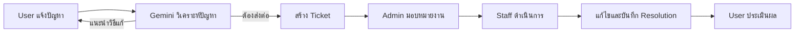

# Smart Helpdesk with AI

[](https://github.com/MatchaWannoi/smart-helpdesk/actions/workflows/ci.yml)

Mini project ระบบแจ้งปัญหา IT และติดตามคำร้อง โดยมี AI ช่วยวิเคราะห์หมวดหมู่ ความเร่งด่วน และแนะนำวิธีแก้ไขเบื้องต้น หาก AI ไม่มั่นใจ ระบบจะสร้าง Ticket เพื่อส่งต่อให้เจ้าหน้าที่

โปรเจกต์นี้สาธิต workflow ของระบบ Helpdesk ตั้งแต่รับแจ้งปัญหา คัดแยกด้วย AI ส่งต่อเจ้าหน้าที่ ติดตามสถานะ ไปจนถึงการประเมินผลหลังปิดงาน โดยแบ่งสิทธิ์การใช้งานตามบทบาทอย่างชัดเจน

## ความสามารถหลัก

- ผู้ใช้ (USER): แชทกับ AI, ดูและติดตาม Ticket, ตอบเจ้าหน้าที่ และประเมินผลหลังแก้ไข
- เจ้าหน้าที่ (STAFF): ดูงานที่ได้รับมอบหมาย, ตอบผู้ใช้, อัปเดตสถานะ และบันทึกวิธีแก้ไข
- ผู้ดูแลระบบ (ADMIN): จัดการผู้ใช้และ FAQ, มอบหมาย Ticket และดูรายงานภาพรวม
- AI: วิเคราะห์หมวดหมู่ NETWORK, HARDWARE, SOFTWARE หรือ ACCOUNT พร้อมระดับความเร่งด่วน

## Workflow ของระบบ



ระบบใช้การตรวจสิทธิ์สองระดับ: Proxy ป้องกันหน้าตามบทบาท และ API ตรวจ session, role รวมถึง ownership ของข้อมูลซ้ำอีกครั้งก่อนอ่านหรือแก้ไขข้อมูล

## เทคโนโลยี

- Next.js 16 และ React 19
- TypeScript และ Tailwind CSS 4
- Auth.js / NextAuth แบบ Credentials
- Prisma ORM และ PostgreSQL
- Google Gemini

## โครงสร้างโปรเจกต์

```text
app/                 หน้าเว็บและ API routes ตาม Next.js App Router
  admin/             หน้าจัดการผู้ใช้ FAQ Ticket และรายงาน
  staff/             หน้ารับงานและอัปเดต Ticket สำหรับเจ้าหน้าที่
  tickets/           หน้าติดตาม Ticket สำหรับผู้ใช้
  api/               API แยกตามขอบเขตสิทธิ์และทรัพยากร
components/          UI component ที่นำกลับมาใช้ซ้ำ
hooks/               Client-side hooks สำหรับระบบแชท
lib/                 Prisma, Gemini และ helper ส่วนกลาง
prisma/              Database schema และ demo seed
proxy.ts             Route protection และ role-based access control
auth.ts              การตั้งค่า Auth.js และ Credentials provider
```

รายละเอียด data model, routes และ process ทั้งหมดอยู่ใน [Project Summary](./smart-helpdesk-project-summary.md)

## การติดตั้ง

ต้องมี Node.js 20 ขึ้นไป, npm และฐานข้อมูล PostgreSQL

1. ติดตั้ง dependencies

   ```bash
   npm install
   ```

2. คัดลอก `.env.example` เป็น `.env` แล้วใส่ค่าจริง

   PowerShell:

   ```powershell
   Copy-Item .env.example .env
   ```

   macOS/Linux:

   ```bash
   cp .env.example .env
   ```

3. สร้าง Prisma Client และตารางฐานข้อมูล

   ```bash
   npx prisma generate
   npx prisma db push
   ```

4. สร้างข้อมูลตัวอย่าง (คำสั่งนี้ล้างข้อมูลเดิมทั้งหมด)

   PowerShell:

   ```powershell
   $env:ALLOW_DESTRUCTIVE_SEED="true"
   npx prisma db seed
   Remove-Item Env:ALLOW_DESTRUCTIVE_SEED
   ```

   macOS/Linux:

   ```bash
   ALLOW_DESTRUCTIVE_SEED=true npx prisma db seed
   ```

5. เปิด development server

   ```bash
   npm run dev
   ```

เปิด [http://localhost:3000](http://localhost:3000)

## บัญชีทดลอง

ข้อมูลเหล่านี้ถูกสร้างโดย `prisma/seed.ts` และใช้สำหรับการสาธิตเท่านั้น

| บทบาท | อีเมล | รหัสผ่าน |
| --- | --- | --- |
| Admin | `admin@helpdesk.com` | `Demo1234!` |
| Staff | `staff.network@helpdesk.com` | `Demo1234!` |
| Staff | `staff.software@helpdesk.com` | `Demo1234!` |
| User | `user@helpdesk.com` | `Demo1234!` |

ห้ามใช้บัญชีหรือรหัสผ่านทดลองกับระบบจริง

## โหมดการตอบของ AI

ค่าเริ่มต้น `AI_USE_FAQ=false` จะให้ Gemini ตอบจากความรู้ของโมเดลโดยตรง หากต้องการให้คำตอบอ้างอิงข้อมูลในตาราง FAQ ให้ตั้งค่า:

```env
AI_USE_FAQ=true
```

จากนั้น restart development server

## คำสั่งที่ใช้บ่อย

```bash
npm run dev       # เปิดระบบสำหรับพัฒนา
npm run lint      # ตรวจโค้ดด้วย ESLint
npm test          # รัน unit tests
npm run build     # ตรวจและ build สำหรับ production
npm run start     # เปิด production build
npx prisma studio # เปิดหน้าจัดการข้อมูลของ Prisma
```

## การตรวจคุณภาพ

ทุก push และ pull request จะรัน GitHub Actions จาก `.github/workflows/ci.yml` เพื่อตรวจสามขั้นตอน:

```bash
npm run lint
npm test
npm run build
```

ก่อนเปิด pull request ควรรันทั้งสามคำสั่งในเครื่องให้ผ่าน โดย production build จะตรวจ TypeScript และความถูกต้องของทุก route ไปพร้อมกัน

## หมายเหตุด้านความปลอดภัย

- `.env` และ secret ต่าง ๆ ถูก Git ignore ห้ามนำค่าจริงขึ้น repository
- เนื้อหาที่ผู้ใช้ส่งในหน้าแชทจะถูกส่งไปยัง Google Gemini เพื่อประมวลผล
- Demo seed จะไม่ทำงานจนกว่าจะตั้ง `ALLOW_DESTRUCTIVE_SEED=true` เพราะสคริปต์จะล้างข้อมูลเดิมก่อนสร้างข้อมูลตัวอย่าง
- บัญชีและรหัสผ่านในหัวข้อบัญชีทดลองเป็นข้อมูลสาธิตที่เปิดเผยต่อสาธารณะ ห้ามนำไปใช้กับระบบจริง

## License

โปรเจกต์นี้เผยแพร่ภายใต้ [MIT License](./LICENSE)
